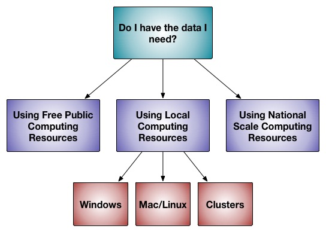

# 入门

此页面是为刚接触Rosetta的科学家们编写的: 或许是一年级研究生，或者年轻的博士后，他们收到/启动了一个需要“一些计算机建模”的项目。换句话说，一个从零开始的Rosetta初学者。Rosetta是您需要做建模的优秀工具吗？如果是这样，您将如何获取和使用Rosetta？如果您已经对这些概念感到熟悉，请随时跳过。

Rosetta是一个非常大的大分子建模软件套件。所谓软件套件，这里我们指的是大量计算机代码的集合（主要是C++,一些是Python，还有一些其他编程语言），但它不是单一的整体程序。通过大分子建模，我们指的是评估和排序生物大分子不同结构的物理学合理性的过程（通常是蛋白质，但核酸和配体【译者注：这里应该指的是小分子】也得到了显著地支持，并且对隐式脂质膜的支持正在增加）。通常，用户会在Rosetta中[选择一些特定的协议](https://new.rosettacommons.org/docs/latest/getting\_started/Solving-a-Biological-Problem)，并向该协议提供以下输入：A）要处理的结构；B）协议中的哪些选项适合于用户的需求。

<figure><figcaption></figcaption></figure>

| 目录 |
| -- |
|    |
|    |
|    |

### 我准备好我需要的东西了吗？

做好大分子建模——做好科学——需要仔细思考您的输入、建模的执行方式以及对输出的分析。Rosetta本身可以作为一个“[黑匣子](https://en.wikipedia.org/wiki/Black\_box)”来运行，但如果您真这样使用的话，结果对您和您所做的项目都是不利的。

#### 1）Rosetta的输入

Rosetta的主要输入是输入结构【译者注：这里面这的“结构”，不特殊说明的话应该统一指的是蛋白结构】。通常，如果您的分子具有高分辨率结构（分辨率小于2埃），只需要[稍加优化](https://new.rosettacommons.org/docs/latest/rosetta\_basics/preparation/preparing-structures)即可与Rosetta一起使用。如果您有分辨率较差的结构、NMR结同源模型、或者根本没有结构，那么您的任务将会困难的多。您任然应该为建模任务[准备好结构](https://new.rosettacommons.org/docs/latest/rosetta\_basics/preparation/preparing-structures)，但是请注意，当从质量较差的结构开始时，建模的效率和效果会降低，并且[解释结果](https://new.rosettacommons.org/docs/latest/getting\_started/Analyzing-Results)也更具有挑战性。

#### 2）选择Rosetta协议

除了结构之外的其他输入是选择使用[哪个Rosetta协议](https://new.rosettacommons.org/docs/latest/getting\_started/Solving-a-Biological-Problem)，以及使用什么[选项](https://new.rosettacommons.org/docs/latest/rosetta\_basics/running-rosetta-with-options#specifying-options)【译者注：可选参数】和[文件输入](https://new.rosettacommons.org/docs/latest/rosetta\_basics/file\_types/file-types-list#commonly-used-input-files)。

#### 3）计算资源

Rosetta软件作为一个整体，是为在超级计算机上运行而编写的，但可以在[许多不同尺寸的规模](https://new.rosettacommons.org/docs/latest/getting\_started/Rosetta-on-different-scales)上运行。
